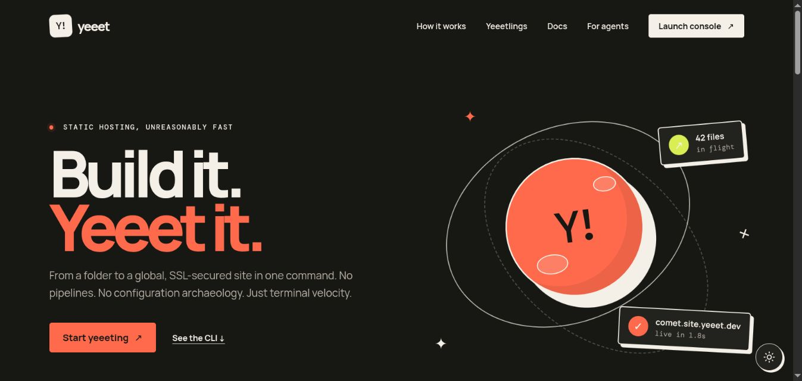
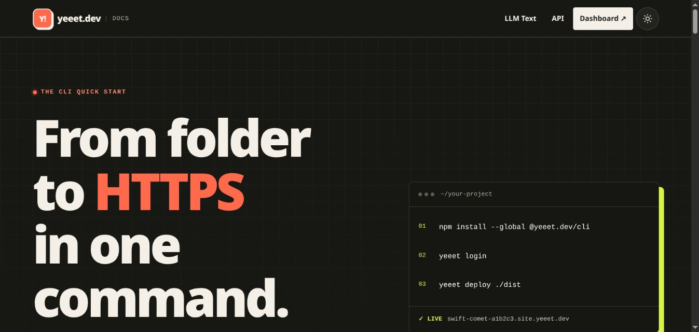
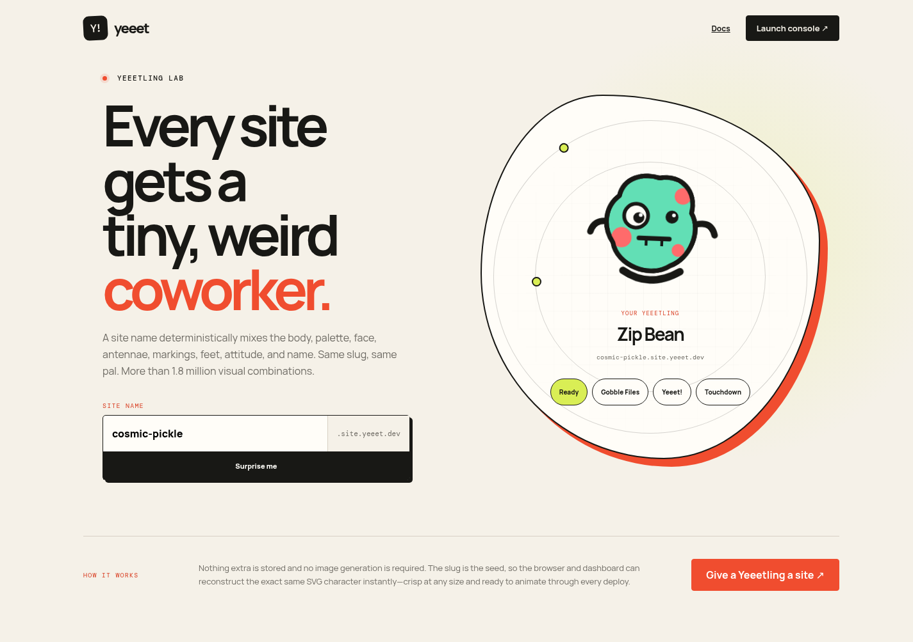

# Yeeet

Yeeet is an open-source static-site deployment platform for humans, command-line
workflows, CI, and coding agents. Give it a file or build directory and it
publishes an atomic, CDN-cached HTTPS deployment on a generated or chosen
subdomain.

<p align="center">
  <a href="https://yeeet.dev">
    
  </a>
</p>

<p align="center">
  <a href="https://github.com/nearbycoder/yeeet.dev/actions/workflows/ci.yml"></a>
  <a href="https://www.npmjs.com/package/@yeeet.dev/cli"></a>
  <a href="LICENSE"></a>
  <a href="https://railway.com/new/template/xVmmCY?utm_medium=integration&utm_source=button&utm_campaign=yeeet"></a>
</p>

The hosted instance lives at [yeeet.dev](https://yeeet.dev). This repository is
the complete platform: the web console, asset gateway, API, database schema,
Railway deployment configuration, documentation site, and the
[`@yeeet.dev/cli`](packages/cli) package.

<table>
  <tr>
    <td width="50%">
      <a href="https://docs.yeeet.dev"></a>
    </td>
    <td width="50%">
      <a href="https://yeeet.dev/mascot"></a>
    </td>
  </tr>
  <tr>
    <td align="center"><strong>Human + LLM-friendly CLI docs</strong></td>
    <td align="center"><strong>A tiny weird coworker for every site</strong></td>
  </tr>
</table>

## Who it is for

- Developers who want to publish a static build without maintaining a pipeline.
- Teams that need immutable previews, fast rollbacks, and private review links.
- Coding agents and CI jobs that need predictable JSON and API-key auth.
- Platform engineers who want a compact, self-hostable static deployment plane.
- Educators, hackathon teams, and internal-tool builders who need disposable URLs.

Yeeet serves already-built static files. It intentionally does not run untrusted
builds or replace a framework's build command.

## What you get

- Browser uploads and a Node.js CLI with the same deployment model.
- Random readable subdomains or stable names such as
  `comet.site.example.com`.
- Atomic releases: a live pointer moves only after every object is verified.
- Immutable version URLs, version history, promotion, rollback, and deletion.
- SPA fallback for refreshes on client-side routes, with strict static mode too.
- Password-protected deployments and revocable one-click private share links.
- Custom domains with Railway-managed DNS verification and TLS.
- Private S3-compatible object storage behind a cache-aware asset gateway.
- Email/password and GitHub login through Better Auth.
- Invitation-only registration, account bans, role management, and audit history.
- An OpenAPI contract, LLM-readable docs, API keys, and stable JSON output.
- A responsive control plane and a deterministic animated mascot for each site.

## How it works

```text
Browser / CLI / agent
        │ manifest + authenticated request
        ▼
TanStack Start control plane ─────────────► Postgres
        │ short-lived signed PUT URLs         │ sites + immutable versions
        ▼                                     │ active deployment pointer
Private S3-compatible bucket ◄───────────────┘
        │
        ▼
Wildcard asset gateway ──► edge cache ──► <site>.<SITE_DOMAIN>
```

Every deployment writes to a unique storage prefix. Finalization verifies the
manifest and changes the active deployment in one database transaction, so an
interrupted upload never replaces a working site. Rollbacks only move that
pointer; they do not copy or mutate files.

Public live aliases use short edge revalidation. Immutable version hosts can be
cached for a year. Version previews and protected deployments emit crawler
blocking headers; protected responses are private and never CDN-cached.

## Use the hosted CLI

Requires Node.js `20.19+` or `22.12+`.

```sh
npm install --global @yeeet.dev/cli
yeeet login
yeeet deploy ./dist                 # generated readable subdomain
yeeet deploy ./dist --name comet    # stable named site
```

Useful release operations:

```sh
yeeet versions comet
yeeet rollback comet
yeeet share comet
yeeet version remove comet <version> --yes
yeeet remove comet --yes
yeeet domain add comet docs.example.com
```

SPA fallback is enabled by default. Use `--static` when every valid path must
map to a real file.

For agents and CI, create an API key in the dashboard and keep it in a secret
store:

```sh
YEEET_TOKEN=yeeet_... yeeet deploy ./dist --name comet --json
```

The CLI can target any self-hosted instance with `--api https://your-domain` or
the `YEEET_API` environment variable.

## One-click Railway deploy

[](https://railway.com/new/template/xVmmCY?utm_medium=integration&utm_source=button&utm_campaign=yeeet)

The template provisions the Yeeet application, PostgreSQL with a persistent
volume, and a private Railway Bucket. Database and bucket credentials are wired
with Railway references, while auth and database secrets are generated per
deployment. The form asks only for:

- the wildcard site suffix you own, such as `site.example.com`;
- the docs hostname, such as `docs.example.com`;
- the initial administrator email or comma-separated emails;
- a private one-time invitation code for the first signup.

Railway gives the control plane a generated HTTPS domain immediately. To make
site and docs routing live, add the control-plane, wildcard, and docs domains to
the app service after deployment, then publish the DNS ownership and ACME
records Railway returns. Apply bucket CORS before browser uploads. The exact
post-deploy checklist is in the
[Railway production setup](docs/railway.md#5-add-the-platform-domains).

GitHub OAuth and automatic user custom-domain provisioning are optional. Add
their variables later if you need them; email/password auth and wildcard site
deployments work without either integration.

## Self-host on Railway

Yeeet is designed around one Railway application service plus Railway Postgres
and an S3-compatible bucket. A Railway Bucket is the simplest production
choice, but the storage adapter also accepts compatible providers.

1. Use the one-click template above, or fork this repository and create an app
   service, Postgres service, and private bucket in one Railway project.
2. If you created the services manually, copy the variables from
   [`.env.example`](.env.example) into the app service and replace every
   development value or blank secret.
3. Set `BETTER_AUTH_URL` to the control-plane origin and `SITE_DOMAIN` to the
   wildcard suffix you own.
4. Add the control-plane domain and `*.SITE_DOMAIN` to the Railway service, then
   publish every DNS record Railway returns—including ownership and ACME
   verification records.
5. Deploy. [`railway.json`](railway.json) builds the app, applies committed
   Drizzle migrations, bootstraps the configured administrators, and checks
   `/health`.

The detailed guide covers variables, GitHub OAuth, bucket CORS, wildcard DNS,
custom-domain provisioning, CDN policy, and verification:
[Railway production setup](docs/railway.md).

Custom domains are optional. If no Railway project token is configured, the
rest of the platform remains usable and the custom-domain API reports that the
feature is unavailable. Railway may apply per-service custom-domain quotas;
the platform wildcard serves any number of Yeeet subdomains without creating a
Railway domain for each site.

## Local development

Prerequisites:

- Node.js `20.19+` or `22.12+`
- PostgreSQL
- A private S3-compatible bucket and credentials

```sh
cp .env.example .env.local
# Fill in BETTER_AUTH_SECRET and the S3 values before starting.
npm install
npm run db:migrate
npm run dev
```

Open <http://localhost:3000>. The example uses `site.localhost` for deployed
sites and `docs.localhost` for the documentation host. Modern browsers resolve
`*.localhost` to loopback. During API-only testing you can also send
`X-Yeeet-Site: <slug>` in development.

Generate a local auth secret with:

```sh
openssl rand -base64 32
```

The first administrator is selected from the comma-separated `ADMIN_EMAILS`
list. Registration remains invitation-only; `INITIAL_INVITATION_CODE` creates
the first bootstrap invitation idempotently.

## Configuration

All deployment-specific values live in environment variables. Important ones:

| Variable                                    | Purpose                                                 |
| ------------------------------------------- | ------------------------------------------------------- |
| `BETTER_AUTH_URL`                           | Public origin of the control plane                      |
| `BETTER_AUTH_SECRET`                        | Random signing secret, at least 32 characters           |
| `DATABASE_URL`                              | PostgreSQL connection string                            |
| `SITE_DOMAIN`                               | Wildcard suffix used for sites and immutable versions   |
| `DOCS_HOST`                                 | Hostname that serves the built-in human and LLM docs    |
| `ADMIN_EMAILS`                              | Comma-separated bootstrap administrator emails          |
| `INITIAL_INVITATION_CODE`                   | Optional first invitation code                          |
| `GITHUB_CLIENT_ID` / `GITHUB_CLIENT_SECRET` | Optional GitHub OAuth app                               |
| `S3_*`                                      | Private S3-compatible bucket connection and credentials |
| `RAILWAY_TOKEN`                             | Optional project token for user custom domains          |
| `MAX_DEPLOY_BYTES`                          | Per-deployment byte limit; defaults to 500 MB           |

See [`.env.example`](.env.example) for the complete list and safe development
defaults. Never commit `.env.local`, Railway tokens, OAuth secrets, database
URLs, bucket credentials, API keys, deployment passwords, or generated share
links.

## Repository map

```text
src/routes/          TanStack pages and API routes
src/server/          deployment, storage, domains, docs, and gateway logic
src/db/              Drizzle schemas
drizzle/             committed SQL migrations and migration metadata
packages/cli/        publishable Node.js CLI
public/              OpenAPI and agent-readable entry points
docs/                operator documentation
scripts/             migrations, admin bootstrap, and bucket CORS helpers
tests/               manifest, routing, access, and docs behavior
```

## Checks

```sh
npm run check
npm run lint
npm run typecheck
npm test
npm run build
```

Pull requests run the same checks in GitHub Actions. See
[CONTRIBUTING.md](CONTRIBUTING.md) before proposing a change and
[SECURITY.md](SECURITY.md) for private vulnerability reporting.

## License

Yeeet is available under the [MIT License](LICENSE). You may use, copy, modify,
distribute, sublicense, and sell copies, including for commercial projects,
subject to the license notice.
